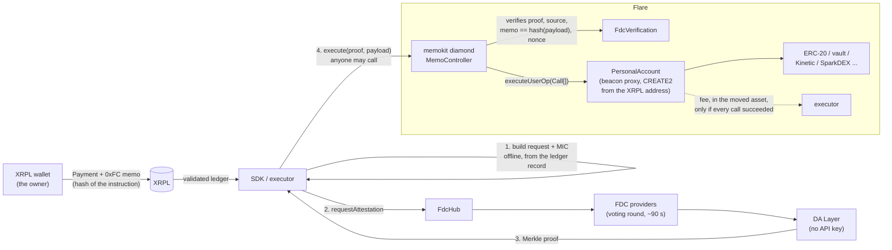

# memokit

**memokit executes XRPL-originated calls on assets a Flare account already holds. There is no
FAssets mint in the path, no Flare-assigned destination tag, and no wallet registration.**

You sign one XRPL Payment. Its memo is a 42-byte commitment to what your Flare account should do.
FDC attests the payment, anyone submits the proof, and the account runs exactly the calls you
committed to: a vault deposit, a payout to five addresses, a borrow, a swap.

Flare Smart Accounts already reaches arbitrary calls through memo opcodes `0xFF`/`0xFE`, but only as
a side effect of `executeDirectMintingWithData`: every instruction mints FXRP and inherits FAssets'
direct-minting limits. That coupling is the gap memokit fills. The account is derived from your XRPL
address alone, so there is nothing to register and no tag to buy.

> **Latency is about two and a half minutes, and that is FDC's round cadence, not this code.**
> XRPL payment to executed call took 152 s and 162 s in Phase 1 and 118 s in Phase 2. About 90% of it
> is one leg, waiting for the FDC voting round to close and the Data Availability Layer to serve the
> proof. Nothing here can shorten that leg, so instructions that depend on a price carry a
> deadline (see [Deadlines](#deadlines)).

## How it works



Flare's verifier server is **not** on the path. The attestation request and its message integrity
code are built from the XRPL ledger record by `sdk/src/fdc/buildResponse.ts`; the verifier is only a
test oracle that proved that code correct.

## What has been run

Everything below was executed against live infrastructure and recorded under
[`fixtures/measurements/`](fixtures/measurements/). Explorer links are the primary evidence; the
JSON traces carry the balances and the latency breakdown.

### Phase 1: a vault deposit, no mint

One XRPL Payment, 5.0 FTestXRP deposited into a live Coston2 ERC-4626 vault out of a balance the
account already held. FTestXRP `totalSupply` is identical in the block before and the block
containing `execute`.

| | |
|---|---|
| XRPL Payment | [`11A56DB8…53A6`](https://testnet.xrpl.org/transactions/11A56DB868A09588C2BBC57E6C957FA080FC78EE42561D26AB1ABBED437753A6) |
| requestAttestation | [`0xded36a56…272e`](https://coston2-explorer.flare.network/tx/0xded36a56c8faccd5c280507c26253f8450804f43ae5f61c6f2bda7bd3e81272e) |
| execute | [`0x69f5259f…1978`](https://coston2-explorer.flare.network/tx/0x69f5259f72139c4307246bbffd11f73937e85eacc34b23dd1718413b56821978) |
| result | 10.0 → 5.0 FTestXRP, 0 → 4.994505 TESTearnXRP shares |
| latency | 152 s |
| trace | [`e2e-trace-live-vault.json`](fixtures/measurements/e2e-trace-live-vault.json) |

That run used the Phase 1 diamond (`fixtures/deployment-phase1.json`). Phase 2 changed the payload
format, so it is a new diamond; see [PHASE2.md](PHASE2.md).

### Phase 2: one payment, five transfers

One XRPL Payment produced five FTestXRP transfers to five Flare addresses, and paid the executor
0.1 FTestXRP out of the same balance, in the asset being moved. The account went from 5.0 to 0.
`totalSupply` unchanged across the execute block; no Transfer from the zero address in the receipt.

| | |
|---|---|
| memokit diamond | [`0x98882776…9E36`](https://coston2-explorer.flare.network/address/0x98882776ED3CB4b3abB86CceFE2f46C1aAed9E36) |
| account | [`0x8F1eD3f5…43b1`](https://coston2-explorer.flare.network/address/0x8F1eD3f5355846008A47ce91Fbc49EE1808d43b1) |
| XRPL Payment | [`3CBD8EC9…48C1`](https://testnet.xrpl.org/transactions/3CBD8EC9C22984B2E2CD97C842BBE01C2A2D34E373705F4C81FB56B08A5948C1) |
| requestAttestation | [`0x220592a4…0102`](https://coston2-explorer.flare.network/tx/0x220592a48930a10d7ec73d2981622d2d94dc3f16b85231c5cb97d2b69d690102) |
| execute | [`0x2f6faf66…64ad`](https://coston2-explorer.flare.network/tx/0x2f6faf66bcb73632cf5762ee93a40e6943670ecf06a382d36766062c4edf64ad) |
| result | +1.2, +1.1, +1.0, +0.9, +0.7 to five recipients; +0.1 to the executor |
| latency | 118 s, one execute attempt |
| trace | [`e2e-trace-payout.json`](fixtures/measurements/e2e-trace-payout.json) |

Lending (Kinetic) and DEX (SparkDEX V3) integrations run on a Foundry **fork of Flare mainnet** with
FDC verification *simulated*; they are not live mainnet transactions. Results are in
[PHASE2.md](PHASE2.md).

<a id="sdk-quickstart"></a>

## SDK quickstart

`sdk/` is a TypeScript library (not yet published; the name is provisional). The whole path is five
calls, and a full vault deposit fits in 29 lines: see [`sdk/README.md`](sdk/README.md).

```ts
const { payload, memo } = prepareInstruction({ sender: account, nonce, feeToken, feeAmount, calls });
const sent    = await sendMemoPayment({ network: COSTON2, wallet, destination, drops: "1000000", memo });
const request = await requestAttestation({ signer, xrplHash: sent.hash, network: COSTON2 });
const { proof } = await waitForProof({ request, network: COSTON2 });
await submit({ signer, controller, proof, payload });
```

## Wire format

Header, byte-identical to Flare's so an integrated wallet changes one byte:

```
byte  0    : opcode
byte  1    : walletId (uint8)
bytes 2..9 : executorFee (uint64, big-endian)  -- RESERVED, must be zero
```

| Opcode | Payload | Length |
|---|---|---|
| `0xFD` | `abi.encode(sender, nonce, feeToken, feeAmount, Call[])` inline | 10 + N |
| `0xFC` | `keccak256(payload)`, payload supplied out of band | 42 |
| `0xF8`–`0xFB` | reserved | — |
| `0xE0` | `targetTxId` — retire a stuck transaction id | 42 |
| `0xE1` | `newNonce` — advance past a stuck instruction | 42 |
| `0xE2` | `targetTxId` + `newFee` — override the executor fee amount | 50 |

`0xE0`/`0xE1`/`0xE2` reuse Flare's opcodes at their original values and semantics. The receiving
XRPL address disambiguates which protocol a memo is addressed to.

**The executor fee is in the payload, not the header.** `feeToken` and `feeAmount` are inside the
hashed instruction, so an executor who reads the preimage cannot change them. The header's
`executorFee` keeps its place and width for byte-compatibility but the contract rejects a non-zero
value. The fee is paid in the asset the instruction moves, after every call has succeeded, in the
same transaction; a failing call unwinds it. See [PHASE2.md](PHASE2.md) for the design and the
griefing analysis.

## Deadlines

Attestation takes minutes and markets do not wait, so an instruction that touches a price should
commit to a deadline and a minimum output in its own calldata. Both are then inside the hash.
`DEFAULT_DEADLINE_SECONDS` is **900**: the worst measured 162 s, plus one missed 90 s round, times
about 3.5. The derivation is next to the constant in `sdk/src/deadline.ts`.

## Layout

```
contracts/    diamond, facets, libraries, personal account and beacon
sdk/          the library: memo codec, offline attestation request, DA client, submit
executor/     scripts: end-to-end runner, payout, measurements, selector pinning
scripts/      Foundry deployment
test/         Solidity tests; test/fork/ runs against a fork of Flare mainnet
fixtures/     golden wire vectors, pinned Flare selector sets, live traces
```

## Getting started

The repo pins `forge-std` as a submodule, so clone with it:

```bash
git clone --recurse-submodules <repo-url>
npm install
forge build
forge test              # 105 Solidity tests
npm test                # 78 TypeScript tests
npm run test:fork       # 15 fork tests: needs network and ffi (fork profile only)
```

Copy `.env.example` to `.env` before deploying or running end to end.

```bash
forge script scripts/DeployMemoKit.s.sol:DeployMemoKit \
  --rpc-url https://coston2-api.flare.network/ext/C/rpc --broadcast
npm run e2e    -w @memokit/executor     # vault deposit
npm run payout -w @memokit/executor     # one payment, five transfers
```

Measurements and checks against live infrastructure:

```bash
npm run verify:mic        -w @memokit/executor   # offline MIC vs Flare's verifier
npm run measure:da        -w @memokit/executor   # DA Layer rate limits and finalisation lag
npm run selectors:check   -w @memokit/executor   # has Flare's controller selector set changed?
```

## Safety machinery

memokit keeps Flare's safety machinery rather than shedding it: a pause facet, an owner-managed
receiving-address registry, and a timelock on economic parameters, with the same
timelocked/immediate split Flare uses. Its facets are meant to be cuttable into Flare's own
diamond, so every external selector is diffed against Flare's live `MasterAccountController` on
Coston2 and mainnet by `test/SelectorCollision.t.sol`. That fixture is a snapshot;
`selectors:check` tells you when Flare has moved on.

## Status and limits

- Live on Coston2 against XRPL Testnet. No mainnet deployment and no mainnet transaction.
- Lending and DEX results are from a mainnet fork with simulated FDC verification.
- The public DA Layer allows about 20 requests a minute; a self-hosted one is the obvious next step.
- A Compound-style market reports some failures as a return value, not a revert. Append a balance
  assertion to any instruction that depends on one (see PHASE2.md).

See [PHASE1.md](PHASE1.md) and [PHASE2.md](PHASE2.md) for what is built, measured and still open.
[phase0-report.md](phase0-report.md) has the investigation this is based on.
