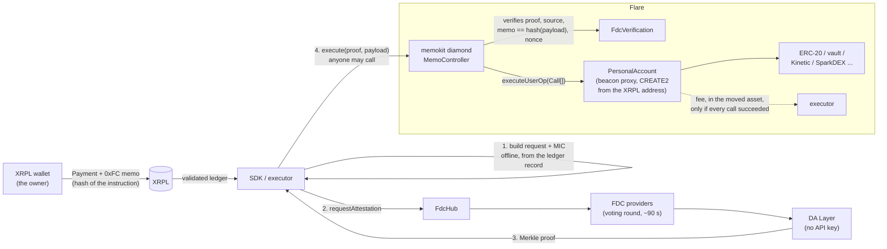

# memokit

**memokit executes XRPL-originated calls on assets a Flare account already holds. There is no
FAssets mint in the path, no Flare-assigned destination tag, and no wallet registration.**

You sign one XRPL Payment. Its memo is a 42-byte commitment to what your Flare account should do.
FDC attests the payment, anyone submits the proof, and the account runs exactly the calls you
committed to: a vault deposit, a payout to five addresses, a borrow, a swap — or a redemption that
sends XRP back to your own XRPL address. You never hold an EVM key at any point.

Flare Smart Accounts already reaches arbitrary calls through memo opcodes `0xFF`/`0xFE`, but only as
a side effect of `executeDirectMintingWithData`: every instruction mints FXRP and inherits FAssets'
direct-minting limits. That coupling is the gap memokit fills. The account is derived from your XRPL
address alone, so there is nothing to register and no tag to buy.

> **Latency is about two and a half minutes, and that is FDC's round cadence, not this code.**
> XRPL payment to executed call took 152 s and 162 s in Phase 1, 118 s in Phase 2 and 127 s in
> Phase 3. About 90% of it
> is one leg, waiting for the FDC voting round to close and the Data Availability Layer to serve the
> proof. Nothing here can shorten that leg, so instructions that depend on a price carry a
> deadline (see [Deadlines](#deadlines)).

## How it works



Flare's verifier server is **not** on the path. The attestation request and its message integrity
code are built from the XRPL ledger record by `sdk/src/fdc/buildResponse.ts`; the verifier is only a
test oracle that proved that code correct.

## What has been run

Everything below was executed against live infrastructure and recorded under
[`fixtures/measurements/`](fixtures/measurements/). Explorer links are the primary evidence; the
JSON traces carry the balances and the latency breakdown.

### Phase 1: a vault deposit, no mint

One XRPL Payment, 5.0 FTestXRP deposited into a live Coston2 ERC-4626 vault out of a balance the
account already held. FTestXRP `totalSupply` is identical in the block before and the block
containing `execute`.

| | |
|---|---|
| XRPL Payment | [`11A56DB8…53A6`](https://testnet.xrpl.org/transactions/11A56DB868A09588C2BBC57E6C957FA080FC78EE42561D26AB1ABBED437753A6) |
| requestAttestation | [`0xded36a56…272e`](https://coston2-explorer.flare.network/tx/0xded36a56c8faccd5c280507c26253f8450804f43ae5f61c6f2bda7bd3e81272e) |
| execute | [`0x69f5259f…1978`](https://coston2-explorer.flare.network/tx/0x69f5259f72139c4307246bbffd11f73937e85eacc34b23dd1718413b56821978) |
| result | 10.0 → 5.0 FTestXRP, 0 → 4.994505 TESTearnXRP shares |
| latency | 152 s |
| trace | [`e2e-trace-live-vault.json`](fixtures/measurements/e2e-trace-live-vault.json) |

That run used the Phase 1 diamond (`fixtures/deployment-phase1.json`). Phase 2 changed the payload
format, so it is a new diamond; see [PHASE2.md](PHASE2.md).

### Phase 2: one payment, five transfers

One XRPL Payment produced five FTestXRP transfers to five Flare addresses, and paid the executor
0.1 FTestXRP out of the same balance, in the asset being moved. The account went from 5.0 to 0.
`totalSupply` unchanged across the execute block; no Transfer from the zero address in the receipt.

| | |
|---|---|
| memokit diamond | [`0x98882776…9E36`](https://coston2-explorer.flare.network/address/0x98882776ED3CB4b3abB86CceFE2f46C1aAed9E36) |
| account | [`0x8F1eD3f5…43b1`](https://coston2-explorer.flare.network/address/0x8F1eD3f5355846008A47ce91Fbc49EE1808d43b1) |
| XRPL Payment | [`3CBD8EC9…48C1`](https://testnet.xrpl.org/transactions/3CBD8EC9C22984B2E2CD97C842BBE01C2A2D34E373705F4C81FB56B08A5948C1) |
| requestAttestation | [`0x220592a4…0102`](https://coston2-explorer.flare.network/tx/0x220592a48930a10d7ec73d2981622d2d94dc3f16b85231c5cb97d2b69d690102) |
| execute | [`0x2f6faf66…64ad`](https://coston2-explorer.flare.network/tx/0x2f6faf66bcb73632cf5762ee93a40e6943670ecf06a382d36766062c4edf64ad) |
| result | +1.2, +1.1, +1.0, +0.9, +0.7 to five recipients; +0.1 to the executor |
| latency | 118 s, one execute attempt |
| trace | [`e2e-trace-payout.json`](fixtures/measurements/e2e-trace-payout.json) |

### Phase 3: out of FSA, and back to XRPL

Two live runs closed the two open directions.

**Import from Flare Smart Accounts.** An XRPL address owns a different account under each protocol,
so FXRP held in an FSA account was unreachable without an EVM wallet. It is now reachable from XRPL
alone: 5.0 FTestXRP relayed by Flare's own operator
([`0x7faeb3ec…7d84`](https://coston2-explorer.flare.network/tx/0x7faeb3ecf2f463cb269a0c2540c57c673cfd8f4d059cdfc4421f743132777d84)),
then 4.0 relayed by us
([`0xe7f4ac74…106b`](https://coston2-explorer.flare.network/tx/0xe7f4ac745ed10d3e45dec8934afd9df9f15ddd3536ba393acaa7db7d4fd5106b)),
162 s. FSA account 10.0 → 1.0, memokit account 10.1 → 19.1.

**Cash out to XRPL.** One XRPL payment redeemed a lot of FXRP through FAssets and XRP arrived back
on XRPL Testnet. Start and end on the XRP Ledger, no EVM key at any point.

| | |
|---|---|
| memokit diamond | [`0x0E762EAe…0714`](https://coston2-explorer.flare.network/address/0x0E762EAe8fe53e5247C22E5B52feD7A018150714) |
| account | [`0x9dD656e6…d741`](https://coston2-explorer.flare.network/address/0x9dD656e6FE2f9B46E57CE29265b3C66feCa2d741) |
| XRPL Payment in | [`A92E0E7C…3E47`](https://testnet.xrpl.org/transactions/A92E0E7CA45E071E641EAD562CFEE04B2C4B839B4BF13A914B19D17B190C3E47) |
| execute | [`0x4527b740…5022`](https://coston2-explorer.flare.network/tx/0x4527b740567a534f15452b65215304d2bdafdcdd216fdc9db01682eb2d105022) |
| XRPL payout | [`F7858109…9ECD`](https://testnet.xrpl.org/transactions/F7858109B0AD251D1BB44227AAB73E10F4651587FA30022278AA497A485E9ECD) |
| result | 19.1 → 9.1 FXRP burned on Flare; 9.948010 XRP delivered on XRPL |
| latency | 127 s to the execute, **321 s** until the XRP landed |
| trace | [`cash-out-trace.json`](fixtures/measurements/cash-out-trace.json) |

The last 193 s of that is not memokit: `redeem` creates an obligation and an FAssets *agent*
discharges it. See [PHASE3.md](PHASE3.md) for what happens when one does not, and for why one 10.0
FXRP lot delivers 9.948010 XRP rather than 10.

Also live on Coston2: the rescue classifier, run against the deployment's real history (7 payments,
1 executed, 6 attested but never delivered).

Lending (Kinetic) and DEX (SparkDEX V3) integrations, the FTSOv2 rate bound and the deep-queue
cash-out run on a Foundry **fork of Flare mainnet** with FDC verification *simulated*; they are not
live mainnet transactions. Results are in [PHASE2.md](PHASE2.md) and [PHASE3.md](PHASE3.md).

<!-- Anchor: #sdk-quickstart, generated from this heading's text. The memokit site links
     here, so renaming the heading breaks that link. An explicit <a id> does not help --
     GitHub strips empty anchor tags, so the heading text is the only guarantee. -->
## SDK quickstart

`sdk/` is a TypeScript library (not yet published; the name is provisional). The whole path is five
calls, and a full vault deposit fits in 29 lines: see [`sdk/README.md`](sdk/README.md).

```ts
const { payload, memo } = prepareInstruction({ sender: account, nonce, feeToken, feeAmount, calls,
                                               postConditions: [erc20DeltaAtLeast(token, to, min)] });
const sent    = await sendMemoPayment({ network: COSTON2, wallet, destination, drops: "1000000", memo });
const request = await requestAttestation({ signer, xrplHash: sent.hash, network: COSTON2 });
const { proof } = await waitForProof({ request, network: COSTON2 });
await submit({ signer, controller, proof, payload });
```

## Wire format

Header, byte-identical to Flare's so an integrated wallet changes one byte:

```
byte  0    : opcode
byte  1    : walletId (uint8)
bytes 2..9 : executorFee (uint64, big-endian)  -- RESERVED, must be zero
```

| Opcode | Payload | Length |
|---|---|---|
| `0xFD` | the instruction, inline | 10 + N |
| `0xFC` | `keccak256(payload)`, payload supplied out of band | 42 |
| `0xFB` | `newNonce` — advance the nonce to **at least** N | 42 |
| `0xF8`–`0xFA` | reserved | — |
| `0xE0` | `targetTxId` — retire a stuck transaction id | 42 |
| `0xE1` | `newNonce` — advance past a stuck instruction (exact) | 42 |
| `0xE2` | `targetTxId` + `newFee` — override the executor fee amount | 50 |

The instruction itself is versioned:

```
byte 0     : payload version (0x02)
bytes 1..  : abi.encode(sender, nonce, feeToken, feeAmount, Call[], PostCondition[])
```

The version byte is in the **payload**, not the header, because the header is chosen by the wallet
and the payload shape by whoever built the instruction. A v1 payload begins with the zero byte of a
left-padded address, so it fails with `UnsupportedPayloadVersion(0)` rather than mis-decoding.

`0xE0`/`0xE1`/`0xE2` reuse Flare's opcodes at their original values and semantics. `0xFB` is
memokit's own: `0xE1` sets an *exact* nonce and reverts if anything else executes during the ~150 s
the memo is in flight, so a rescue for a stuck queue can fail because the queue unstuck itself.
`0xFB` is monotonic and idempotent. The receiving XRPL address disambiguates which protocol a memo
is addressed to.

**The executor fee is in the payload, not the header.** `feeToken` and `feeAmount` are inside the
hashed instruction, so an executor who reads the preimage cannot change them. The header's
`executorFee` keeps its place and width for byte-compatibility but the contract rejects a non-zero
value. The fee is paid in the asset the instruction moves, after every call has succeeded, in the
same transaction; a failing call unwinds it. See [PHASE2.md](PHASE2.md) for the design and the
griefing analysis.

## Deadlines

Attestation takes minutes and markets do not wait, so an instruction that touches a price should
commit to a deadline and a minimum output in its own calldata. Both are then inside the hash.
`DEFAULT_DEADLINE_SECONDS` is **900**: the worst measured 162 s, plus one missed 90 s round, times
about 3.5. The derivation is next to the constant in `sdk/src/deadline.ts`.

## Layout

```
contracts/    diamond, facets, libraries, personal account and beacon
sdk/          the library: memo codec, offline attestation request, DA client, submit
executor/     scripts: end-to-end runner, payout, measurements, selector pinning
scripts/      Foundry deployment
test/         Solidity tests; test/fork/ runs against a fork of Flare mainnet
fixtures/     golden wire vectors, pinned Flare selector sets, live traces
```

## Getting started

The repo pins `forge-std` as a submodule, so clone with it:

```bash
git clone --recurse-submodules <repo-url>
npm install
forge build
forge test              # 145 Solidity tests
npm test                # 131 TypeScript tests
npm run test:fork       # 24 fork tests: needs network and ffi (fork profile only)
```

Copy `.env.example` to `.env` before deploying or running end to end.

```bash
forge script scripts/DeployMemoKit.s.sol:DeployMemoKit \
  --rpc-url https://coston2-api.flare.network/ext/C/rpc --broadcast
npm run e2e      -w @memokit/executor   # vault deposit
npm run payout   -w @memokit/executor   # one payment, five transfers
npm run import-fsa -w @memokit/executor # pull FXRP out of a Flare Smart Accounts account
npm run cash-out -w @memokit/executor   # redeem FXRP, XRP back on XRPL
npm run rescue   -w @memokit/executor   # classify every payment an owner sent
```

Measurements and checks against live infrastructure:

```bash
npm run verify:mic        -w @memokit/executor   # offline MIC vs Flare's verifier
npm run measure:da        -w @memokit/executor   # DA Layer rate limits and finalisation lag
npm run selectors:check   -w @memokit/executor   # has Flare's controller selector set changed?
```

## Safety machinery

memokit keeps Flare's safety machinery rather than shedding it: a pause facet, an owner-managed
receiving-address registry, and a timelock on economic parameters, with the same
timelocked/immediate split Flare uses. Its facets are meant to be cuttable into Flare's own
diamond, so every external selector is diffed against Flare's live `MasterAccountController` on
Coston2 and mainnet by `test/SelectorCollision.t.sol`. That fixture is a snapshot;
`selectors:check` tells you when Flare has moved on.

On top of that, three things protect the instruction itself.

**Post-conditions.** `PostCondition[]` states what the instruction was *for*, separately from how
it was done, and is covered by the same hash as the calls, so no executor can weaken it. Balance
and delta kinds for ERC-20 and native, measured on any address — a payout asserts that each
recipient was paid. They are evaluated after the calls and before the executor fee, so an
instruction that did not deliver does not pay for delivery, and a failure reverts everything
including the replay mark, so the same proof works again once the cause is gone. This exists
because a Compound-style market reports most failures as a return value rather than a revert.
**Every condition is a floor**: there is no "at most" and no "went down by" yet.

**An FTSOv2 rate bound.** `FtsoRateAtLeast` bounds a realised swap rate against the oracle at
execution time. It catches pool manipulation, sandwiching and thin pools — a 31% pool move that a
signed absolute floor let through is refused at a 1% oracle bound. It does **not** catch genuine
market movement during the ~150 s an attestation takes, because the oracle moves with the market;
that is what the deadline is for. Use both. Feed decimals are read live rather than committed,
because 3 of 7 reference feeds report different decimals on Coston2 than on Flare mainnet.

**Rescue.** An instruction can stall in four places and they all look identical from outside.
`classifyPayments` sorts every payment an owner sent into seven states and says what is lost in
each — the carrier payment, the attestation fee and the instruction are three different things.
**The account's assets are never at risk in any stalled state**, because they never moved. See
[PHASE3.md](PHASE3.md) for the table and for `0xFB`.

## Status and limits

What has run against live infrastructure, and what has not:

| | Coston2 + XRPL Testnet | Flare mainnet fork, FDC simulated |
|---|---|---|
| vault deposit, no mint | live | — |
| payout, 1 payment → 5 transfers | live | live |
| executor fee in the moved asset | live | live |
| import from Flare Smart Accounts | live | — |
| cash out to XRPL | live | live |
| rescue classifier | live | — |
| lending (Kinetic) | — | fork |
| DEX (SparkDEX V3) | — | fork |
| FTSOv2 rate bound | — | fork, real oracle |

Limits, stated rather than left to be discovered:

- **No mainnet deployment and no mainnet transaction.** Everything live is Coston2 and XRPL Testnet.
- **Post-conditions are floors only.** An instruction that spends cannot assert its own purpose;
  a cash-out asserts what it left behind instead.
- **A cash-out is not atomic and not instant.** `redeem` creates an obligation that an FAssets
  *agent* discharges — 193 s in the live run — or is defaulted on, in which case the redeemer is
  paid in collateral on Flare rather than XRP, and somebody has to submit the non-existence proof.
- **One lot does not deliver one lot.** 10.000000 FXRP produced 9.948010 XRP, through an FAssets
  pool fee and the agent's redemption fee. Quote from the event, not from the lot size.
- **A payload-format change needs a redeploy, and a redeploy moves every account address.**
  `executor/src/migrateFunds.ts` is the way across; without it, funds are stranded.
- **A testnet's FAssets redemption queue is inventory.** The first live cash-out attempt reverted
  `RedeemZeroLots()` against an empty queue.
- **The public DA Layer allows about 20 requests a minute**; a self-hosted one is the obvious next
  step. `eth_getLogs` is capped at 30 blocks on the public RPC, which bounds every backward search.
- **A Compound-style market reports some failures as a return value, not a revert.** Attach a
  post-condition to any instruction that depends on one.

See [PHASE1.md](PHASE1.md), [PHASE2.md](PHASE2.md) and [PHASE3.md](PHASE3.md) for what is built,
measured and still open. [phase0-report.md](phase0-report.md) has the investigation this is based
on.
